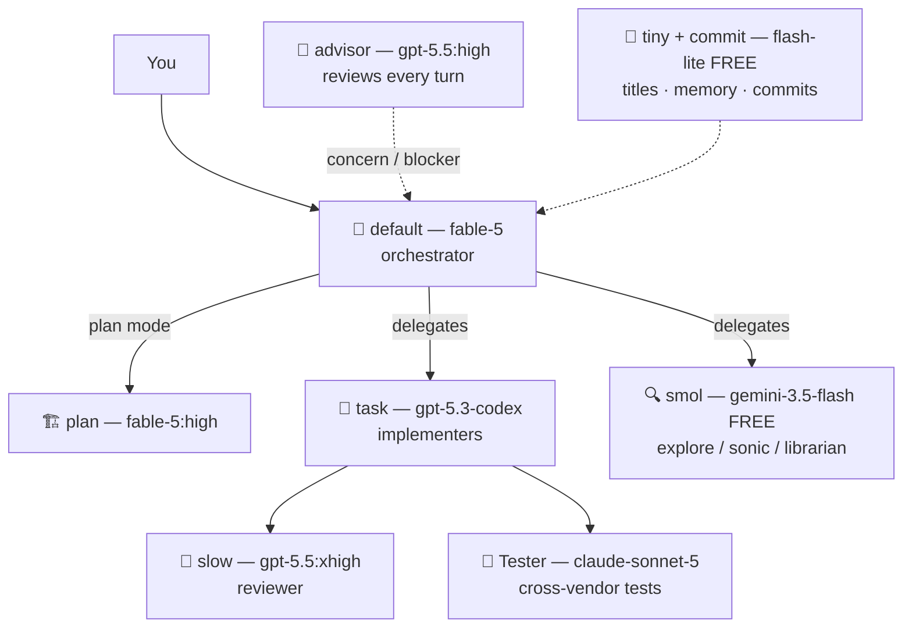

# omp-orchestra

**Cost-tiered model orchestration for [Oh My Pi](https://github.com/oh-my-pi) (`omp`).**

Frontier models orchestrate, plan, and validate. Cheap coding models implement. Free models scout. Every quota wall degrades gracefully instead of stalling your session.

```sh
curl -fsSL https://raw.githubusercontent.com/rockclaver/omp-orchestra/main/install.sh | sh              # fable profile (default)
curl -fsSL https://raw.githubusercontent.com/rockclaver/omp-orchestra/main/install.sh | sh -s -- opus   # or: codex
```

The installer only uses `omp config set` (schema-validated, merge-safe) — your theme, keybindings, and approvals are untouched, and your previous `config.yml` is backed up first. No secrets are read or written. Re-run with a different [profile](#frontier-profiles) at any time to swap the frontier.

## Philosophy

One frontier model doing everything is the most expensive and *slowest* way to run an agent harness: it burns premium quota on file scouting, commit messages, and session titles, then rate-limits right when you need it to think.

omp supports a **model role** per job. This config exploits that fully:

| Tier | Role(s) | Model | Job |
|---|---|---|---|
| 🧠 Frontier | `default` | `claude-fable-5` | Orchestrates, makes judgment calls (availability fallbacks: `opus-4-8` → `gpt-5.5`) |
| 🧠 Frontier | `slow` | `gpt-5.5:xhigh` | `reviewer` agent — deep validation, **cross-vendor** from the orchestrator |
| 🧠 Frontier | `advisor` | `gpt-5.5:high` | Passively reviews *every completed turn*, interrupts on material risk |
| 🏗️ Architect | `plan` | `claude-fable-5:high` | Plan mode + `plan` agent |
| 🔨 Implementer | `task` | `gpt-5.3-codex:medium` | `task` workers — coding-tuned, cheap on quota |
| 🔨 Implementer | — | `claude-sonnet-5:medium` | `Tester` agent — tests authored by a **different vendor** than the implementer |
| 🔍 Scout | `smol` | `gemini-3.5-flash` *(free)* | `explore` / `sonic` / `librarian` — high-volume reading |
| 🤖 Background | `tiny`, `commit` | `gemini flash-lite` *(free)* | Titles, memory, thinking-depth classification, commit messages |



### Why cross-vendor validation

Same-vendor models share blind spots. Here, Claude's orchestration is reviewed by GPT-5.5; Codex's implementations are tested by Claude Sonnet. Vendor-correlated failure modes don't survive the pipeline.

## Frontier profiles

The frontier slice — orchestrator (`default`), architect (`plan`), deep validator (`slow`), per-turn `advisor`, and their 429 fallback chains — is a **profile**. Validators always sit on a different vendor than the orchestrator. Everything else (implementers, scouts, background tiers, quota chains for them) is shared:

| Profile | Orchestrator | Architect | Deep validator + advisor |
|---|---|---|---|
| `fable` *(default)* | `claude-fable-5` | `claude-fable-5:high` | `gpt-5.5` |
| `opus` | `claude-opus-4-8` | `claude-opus-4-8:high` | `gpt-5.5` |
| `codex` | `gpt-5.5` | `gpt-5.5:high` | `claude-opus-4-8` |

Swap by re-running the installer — idempotent, merge-safe, config backed up first:

```sh
./install.sh opus                        # or: fable, codex
OMP_ORCHESTRA_PROFILE=codex ./install.sh # env var works too (e.g. for curl | sh)
```

Per-profile reference slices live in [`config/profiles/`](config/profiles/).

## Quota resilience (the part that actually saves you money)

Subscription plans fail at the margin: you hit the 5-hour window and either wait, buy a second account, or upgrade. This config attacks that three ways:

1. **Role routing** keeps premium windows for premium work — scouts and background jobs never touch them.
2. **`retry.fallbackChains`** (per role): on a 429, the session switches down a chain — e.g. `task` falls to `gpt-5.3-codex-spark` (a *separate, usually idle* Codex quota window), then free Antigravity Claude, then per-token DeepSeek (`$0.435/$0.87 per 1M`, effectively unlimited) — and reverts automatically when the cooldown expires.
3. **`defaultThinkingLevel: auto`** — a free tiny model classifies each prompt's difficulty, so trivial turns stop burning frontier high-thinking output tokens (the most expensive tokens you own).

Measured on the author's telemetry before/after: the single biggest waste was a frontier model assigned to the `smol` scout role — 27% of all rate-limit errors came from that one misrouting.

## What the installer sets

| Key | Value |
|---|---|
| `modelRoles` | The routing table above (comma lists = availability fallbacks) |
| `retry.fallbackChains` | Per-role 429 degradation chains |
| `defaultThinkingLevel` | `auto` |
| `modelProviderOrder` | Subscription/free providers before per-token ones |
| `advisor.enabled` / `syncBacklog` | `true` / `3` — bounded catch-up, no stalls |
| `task.agentModelOverrides` | `Tester` → Claude (cross-vendor) |
| `task.enableLsp` | Workers get live diagnostics |
| `task.eager` | `preferred` — bias the orchestrator toward delegating |
| `task.showResolvedModelBadge` | See which model each subagent actually ran on |
| `WATCHDOG.md` | Advisor review priorities tuned for cheap-implementer failure modes |

Reference copies live in [`config/`](config/); `install.sh` is canonical.

## Requirements

- [omp](https://github.com/oh-my-pi) installed
- Provider credentials (any subset works — role chains skip providers you haven't connected):
  - **Anthropic** — Claude subscription (`/login` in omp)
  - **OpenAI Codex** — ChatGPT plan (`/login`)
  - **Google Antigravity** — free tier (`/login`) — carries the scout + background tiers
  - **OpenRouter** — API key — pennies-per-month overflow absorber (DeepSeek)

## Customization

- Different frontier? Swap [profiles](#frontier-profiles): `./install.sh opus`. For a model outside the built-in profiles, edit `~/.omp/agent/config.yml` → `modelRoles.default`.
- More/less advisor: `omp config set advisor.enabled false`, or tune `advisor.syncBacklog` (`off`/`1`/`3`/`5`).
- Per-project overrides: drop a `.omp/config.yml` in any repo — same keys, project-scoped.
- Deeper thinking by default: `omp config set defaultThinkingLevel high`.

## Uninstall / restore

The installer backs up your previous config next to the live one:

```sh
AGENT_DIR="$(omp config path)"
ls "$AGENT_DIR"/config.yml.orchestra-bak.*   # pick one
cp "$AGENT_DIR/config.yml.orchestra-bak.<stamp>" "$AGENT_DIR/config.yml"
```

## License

[MIT](LICENSE)
